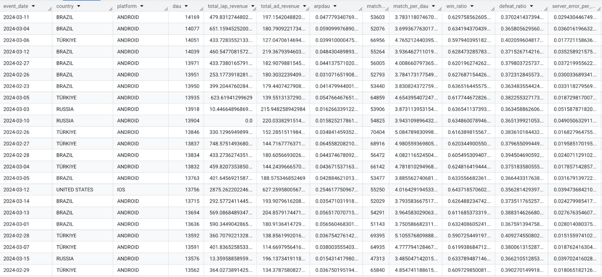
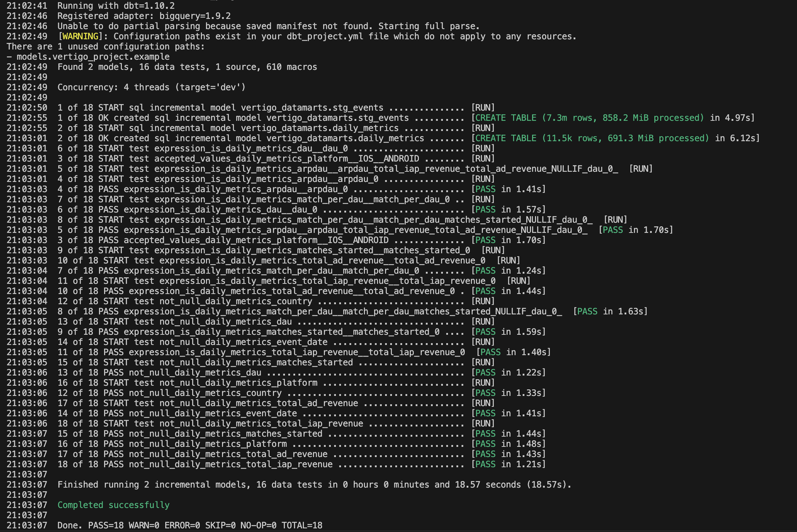

# 📊 DBT Project

A dbt project built to transform raw game data into clean, reliable daily metrics. This project uses Google BigQuery as the data warehouse and leverages incremental models, partitioning, clustering, and data tests to ensure performance and data quality.

---

## 🚀 Features

- Incremental data processing for efficient refreshes  
- Partitioning by date and clustering by country & platform for optimized queries  
- Data quality checks with custom and built-in dbt tests  
- Aggregation of user activity and revenue metrics per day, country, and platform
  
---

This project includes several key files and folders:

- `sources.yml`: Defines raw data sources from BigQuery  
- `models/staging/stg_events.sql`: Cleans and filters raw event data with incremental, partitioned, and clustered configuration  
- `models/marts/daily_metrics.sql`: Aggregates daily user and revenue metrics using incremental strategy  
- `models/marts/schema.yml`: Model documentation and data tests for `daily_metrics`  
- `macros/tests/generic/expression_is.sql`: Custom dbt test macro for validating expressions  
- `dbt_project.yml`: Project configuration specifying paths, packages, and materialization defaults  

---

This project uses the following technology stack:

- **Transformation Tool**: dbt (data build tool)  
- **Data Warehouse**: Google BigQuery  
- **Languages**: SQL templated with Jinja for dbt  
- **Packages**: dbt-utils for enhanced SQL functions  
- **Version Control**: GitHub  

---

### ⚙️ Getting Started

To run this project locally, follow these steps:

1. Clone the repository and set up virtual env:  
   ```bash
   git clone <your-repo-url>  
   cd dbt-metrics
   deactivate                                              
   rm -rf venv             
   python3 -m venv venv
   source venv/bin/activate
   ```
   
2. Set up your dbt profile (`profiles.yml`) with your Google BigQuery credentials and project info.

3. Install required packages:  
   ```bash
   pip install dbt-bigquery
   dbt deps ```

5. Run the dbt models to build your transformed tables:  
   ``` bash
    dbt run

7. Execute tests to ensure data quality:  
   ```bash
    dbt test

8. Generate and view documentation locally:  
   ```bash
   dbt docs generate  
   dbt docs serve

---

### 🔍 Model Highlights

- **stg_events**:  
  Filters out invalid raw data, normalizes `platform` and `country` fields, and uses an incremental merge strategy with partitioning by `event_date` and clustering by `country` and `platform`.

- **daily_metrics**:  
  Aggregates daily active users, in-app purchase and ad revenue, calculates ARPDAU (average revenue per daily active user), match statistics, win/defeat ratios, and server error rates. Uses incremental merges with unique keys on `(event_date, country, platform)` and includes comprehensive data tests to validate metrics.

---

## ✅ Testing and Validation

The project applies rigorous data quality checks including:

- Null checks on key columns such as `event_date`, `country`, and `platform`  
- Accepted values test on `platform` (allowed values: `IOS`, `ANDROID`)  
- Custom expression tests using the `expression_is` macro to validate logical conditions (e.g., `dau > 0`, `arpdau >= 0`)  
- Incremental runs process only new or updated data for efficiency  

## 📦 File Structure
```

dbt_project/
├── analyses/              # Optional SQL analyses not part of the main DAG
├── assets/                # Static assets (e.g., screenshots, csvs)
├── macros/                # Custom Jinja macros to reuse logic across models
├── models/                # Core data models
│   ├── marts/             # Business-level models (final reporting layer)
│   │   ├── daily_metrics.sql  # Example fact table for daily metrics
│   │   └── schema.yml         # Describes tests and metadata for marts
│   └── staging/           # Staging layer: cleans and preps raw data
│       ├── stg_events.sql     # Staging model for event data
│       └── sources.yml        # Defines external sources (raw tables)
├── seeds/                 # Static CSV data loaded with dbt seed
├── snapshots/             # Snapshots for tracking slowly changing dimensions (SCDs)
├── tests/                 # Generic or custom dbt tests
│   ├── generic/             # Generic dbt tests
│   │   ├── daily_metrics.sql  # Custom dbt test macro for validating expressions 
├── .gitignore             # Files and directories to be ignored by Git
├── dbt_project.yml        # Main dbt project configuration file
├── package-lock.yml       # (Optional) Lockfile for managing dbt or system dependencies
├── packages.yml           # dbt packages used in the project
└── README.md              # Project documentation (this file)

```
---
### 🖼️ Dashboard Preview



---

### 🔍 CLI Output: dbt build



---

## 📄 Sample Data

This repository includes a sample CSV file used for local testing or demonstration purposes.

- **File:** `assets/daily_metrics_sample.csv`  
- **Usage:** You can use this file to test source freshness, seed loading, or mock pipeline execution with `dbt seed`.

